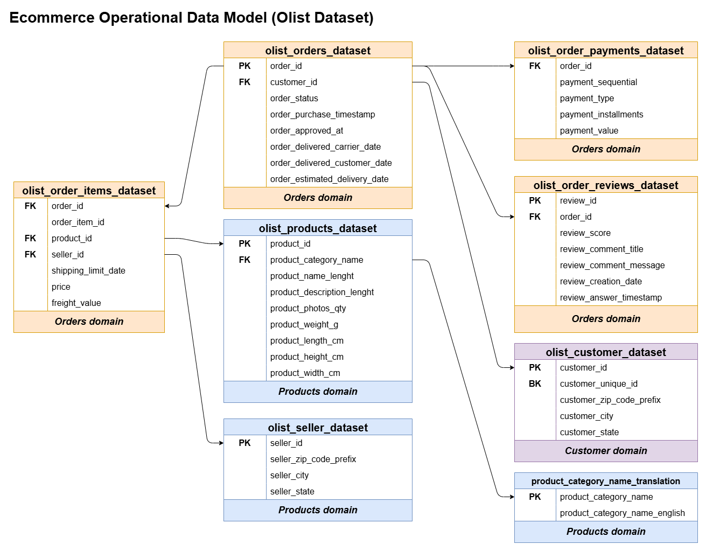
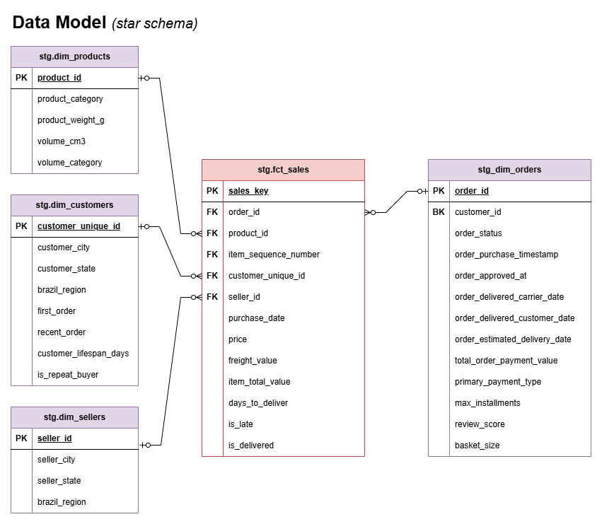
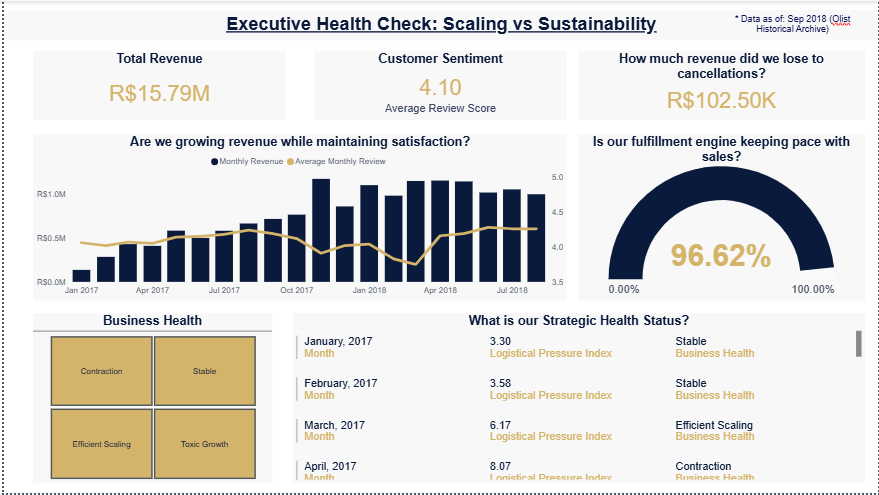
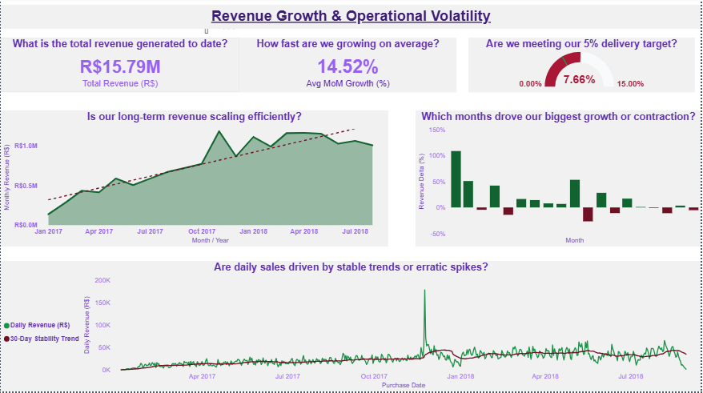
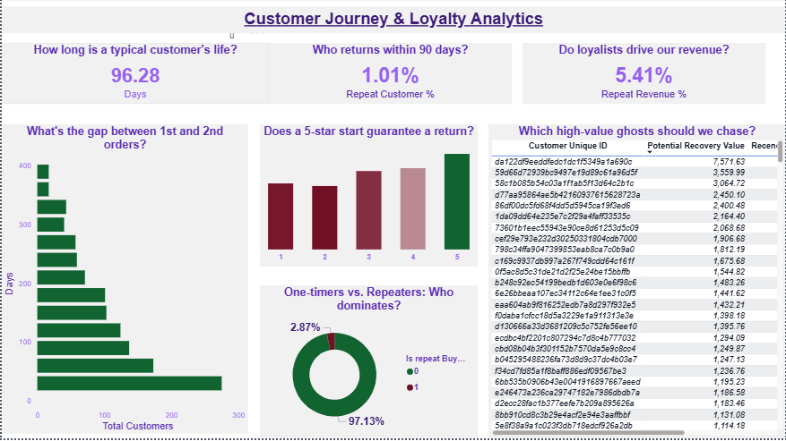
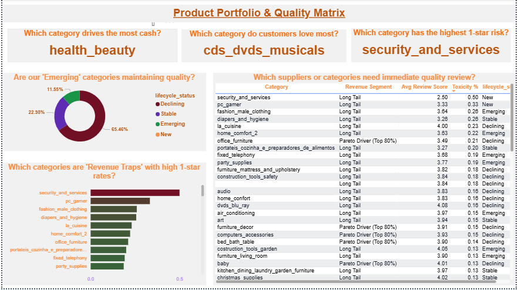
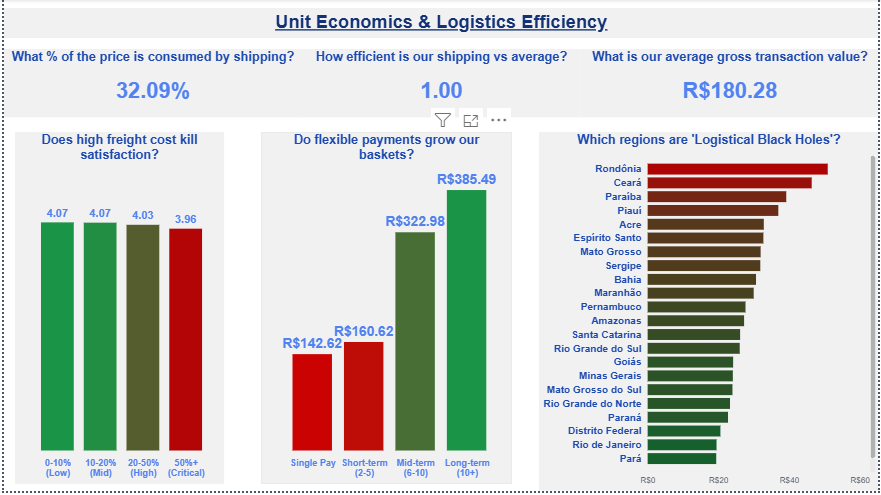
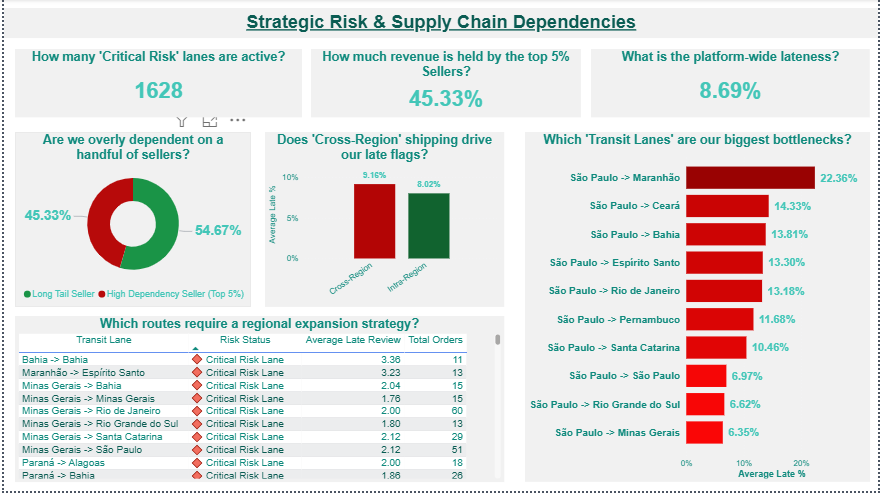

# Olist E-Commerce Strategy Dashboard: Scaling vs. Sustainability

> **Core Question:** Can a marketplace grow revenue without destroying the brand equity that sustains it?

This project transforms the raw Olist Brazilian E-Commerce dataset into a five-pillar strategic intelligence system. Built on a PostgreSQL staging layer and visualized in Power BI, the goal was to move beyond vanity metrics and surface the friction points — logistics bottlenecks, revenue traps, and seller concentration risks — that threaten long-term platform health.

---

## Table of Contents
1. [Architecture & Data Engineering](#1-architecture--data-engineering)
2. [The Five-Pillar Dashboard System](#2-the-five-pillar-dashboard-system)
3. [Key Findings](#3-key-findings)
4. [Known Limitations & Analytical Honesty](#4-known-limitations--analytical-honesty)
5. [Tech Stack](#5-tech-stack)
6. [AI Disclaimer](#6-ai-disclaimer)

---

## 1. Architecture & Data Engineering

### From 3NF to Star Schema

The raw Olist dataset arrives in a normalized 3NF operational structure — optimized for transactions, not analysis. The first engineering challenge was transforming this into a Star Schema that minimizes joins and maximizes Power BI query performance.

**Initial Operational Model (3NF)**


**Final Analytical Model (Star Schema)**


### Staging Layer: Three-Tier Architecture

The pipeline follows a strict three-tier separation of concerns:

```
RAW (Source Tables) → STAGING (Dimensions + Fact) → CORE (Analytical Views) → Power BI
```

| Layer | Objects | Purpose |
|---|---|---|
| `raw` | Source CSVs | Untouched source of truth |
| `stg` | `dim_customers`, `dim_orders`, `dim_products`, `dim_sellers`, `fct_sales` | Cleaned, deduplicated, grain-enforced dimensions and fact table |
| `core` | 6 analytical views | Pre-aggregated, business-logic-encoded views feeding Power BI directly |

### Dimension & Fact Table Design

**`stg.fct_sales`** — Grain: one row per order item
- Surrogate key generated via `ROW_NUMBER()` ordered on `order_id` + `order_item_id`
- Pre-calculates `is_late`, `is_delivered`, `days_to_delivery`, and `item_total_value` at the source
- Status flags cast to `INT` to enable direct `SUM()` aggregation in Power BI without DAX overhead

**`stg.dim_customers`** — Grain: one row per `customer_unique_id`
- Resolves the Olist-specific problem of one `customer_unique_id` mapping to multiple `customer_id` records
- Engineers `customer_lifespan_days`, `is_repeat_buyer`, `first_order`, and `recent_order` at the dimension level
- Maps state abbreviations to full names and classifies into Brazil's five geographic regions

**`stg.dim_orders`** — Grain: one row per `order_id`
- Aggregates payment data (type, installments, total value) and review scores into a single order-level record
- Uses `COALESCE(AVG(review_score), -1)` as a sentinel value to distinguish "no review" from a genuine low score

**`stg.dim_products`** — Grain: one row per `product_id`
- Translates Portuguese category names to English
- Engineers `volume_cm3` from physical dimensions and classifies into Small / Medium / Large / Extra Large buckets

**`stg.dim_sellers`** — Grain: one row per `seller_id`
- Resolves duplicate seller locations and maps to state and region

### Core Analytical Views

| View | Pillar | Key Logic |
|---|---|---|
| `vw_executive_summary` | Executive Health Check | Toxic Growth detection; joins revenue trends with sentiment and cancellation leakage |
| `vw_p1_monthly_growth` | Revenue Intelligence | MoM growth; rolling 3-month trailing average baseline (eliminates data leakage vs. global average) |
| `vw_p1_daily_volatility` | Revenue Intelligence | 30-day rolling average and standard deviation for revenue stability analysis |
| `vw_p2_customer_journey` | Customer Intelligence | RFM-adjacent metrics; 90-day return flag; churn flag at 180-day recency threshold |
| `vw_p2_winback_segmentation` | Customer Intelligence | Filters churned customers with positive first experience and above-average LTV for re-engagement targeting |
| `vw_p3_product_quality_matrix` | Product Intelligence | Pareto 80/20 classification; toxicity ratio (1-star %); quality-volume matrix; lifecycle tagging |
| `vw_p4_unit_economics` | Logistics Intelligence | Regional freight efficiency index; freight-to-price ratio buckets; installment group segmentation |
| `vw_p5_strategic_risk_map` | Strategic Risk | Seller concentration dependency; transit lane late rate; cross-region vs. intra-region risk classification |

---

## 2. The Five-Pillar Dashboard System

### Page 0 — Executive Health Check: Scaling vs. Sustainability


**Business Question:** Are we growing revenue while maintaining the customer satisfaction that sustains it?

**Key Metrics:**
- Total Revenue: R$15.79M
- Average Review Score: 4.10
- Fulfillment Ratio: 96.62%
- Cancellation Revenue Leakage: R$102.50K

**Toxic Growth Detection Logic:**

The executive summary introduces a custom `business_health_status` classification that aligns revenue momentum with customer sentiment:

| Status | Definition |
|---|---|
| Toxic Growth | MoM revenue growth > 0% AND current sentiment < 98% of prior month sentiment |
| Efficient Scaling | MoM revenue growth > 0% AND sentiment stable or improving |
| Contraction | MoM revenue growth < 0% |
| Stable | All other conditions |

> **Finding:** Toxic Growth detected between Oct 2017 and Feb 2018 — the period of Olist's sharpest revenue acceleration. Fulfillment strain during this window caused sentiment to deteriorate even as top-line numbers looked strong, masking a growing brand equity risk.

---

### Page 1 — Revenue Growth & Operational Volatility


**Business Question:** Is growth driven by a rising baseline or by promotional event dependency?

**Key Metrics:**
- Avg MoM Growth: 14.52%
- Late Delivery Rate: 7.66% (against a 5% operational threshold)

**Key Logic:**
- Seasonality Index uses a **rolling 3-month trailing average** as the baseline (not a global average) to eliminate forward data leakage — the platform cannot know its full-year average in real time
- Daily volatility tracked via 30-day rolling standard deviation to distinguish structural growth from event-driven spikes

> **Finding:** The November 2017 Black Friday spike is the single largest daily revenue event in the dataset. Daily volatility increases alongside revenue scale — suggesting the platform is becoming more dependent on event peaks, not less.

---

### Page 2 — Customer Journey & Loyalty Analytics


**Business Question:** Who comes back, and what predicts their return?

**Key Metrics:**
- Repeat Customer Rate: 2.87%
- Repeat Revenue Contribution: 5.41%
- Average Customer Lifespan (repeat buyers only): 96.28 days
- 90-Day Return Rate: 1.01%

**Key Logic:**
- Churn defined as recency > 180 days from dataset max date
- 90-day return window used as the loyalty threshold (industry standard varies; 30-day and 365-day windows are common alternatives)
- Win-back segmentation targets churned customers who left satisfied (review ≥ 4) with above-average lifetime value — the highest probability re-engagement pool

> **Finding:** A 5-star first order experience is the strongest predictor of a 90-day return. However, the 97.13% one-time buyer rate likely reflects Olist's marketplace structure — customers buy across categories from different sellers without strong platform brand recall — rather than pure retention failure.

---

### Page 3 — Product Portfolio & Quality Matrix


**Business Question:** Which categories are revenue engines, which are revenue traps, and which need immediate quality intervention?

**Key Metrics:**
- Top Revenue Category: health_beauty
- Highest Customer Love: cds_dvds_musicals
- Highest 1-Star Risk: security_and_services (Toxicity Ratio: 0.50)

**Quality-Volume Matrix Classification:**

| Quadrant | Definition | Action |
|---|---|---|
| Core Strengths | Above avg revenue + avg review ≥ 4.0 | Protect and scale |
| Revenue Traps | Above avg revenue + avg review < 3.5 | Investigate and intervene |
| Niche Winners | Below avg revenue + avg review ≥ 4.0 | Monitor for scaling opportunity |
| Underperformers | Below avg revenue + avg review < 3.5 | Deprioritize or exit |

> **Finding:** `security_and_services` is the clearest Revenue Trap — high volume but a 0.50 toxicity ratio signals a systemic quality or fulfillment failure that threatens brand equity at scale.

---

### Page 4 — Unit Economics & Logistics Efficiency


**Business Question:** Where does freight cost destroy margin and satisfaction simultaneously?

**Key Metrics:**
- Avg Freight-to-Price Ratio: 32.09%
- Regional Efficiency Index (platform avg): 1.00
- Avg Gross Transaction Value: R$180.28

**Key Logic:**
- `regional_efficiency_index` benchmarks each transaction's freight cost against its regional average — isolating genuine outliers from geographic baseline variation
- Installment group segmentation reveals the relationship between payment flexibility and basket size

> **Finding:** Long-term installment buyers (10+ payments) generate 2.7x the basket size of single-pay buyers (R$385.49 vs R$142.62). However, freight consumes 32% of average order price — transactions in the Critical freight bucket (50%+) show measurably lower satisfaction scores (3.96 vs 4.07), suggesting freight cost is a direct satisfaction lever.

> **Logistical Black Holes:** Rondônia, Ceará, and Paraíba carry the highest absolute freight costs — driven by geographic remoteness and infrastructure constraints, not seller inefficiency.

---

### Page 5 — Strategic Risk & Supply Chain Dependencies


**Business Question:** Where is the platform most exposed to a single point of failure?

**Key Metrics:**
- Critical Risk Lanes: 1,628
- Top 5% Seller Revenue Concentration: 45.33%
- Platform-Wide Late Rate: 8.69%

**The São Paulo Concentration Risk:**

> The single most important finding in this project: **45.33% of platform revenue is controlled by the top 5% of sellers, of whom 63.54% are based in São Paulo.** This means a single logistics disruption in São Paulo — a strike, a flood, a carrier failure — puts approximately 45% of total platform revenue at immediate risk. This is not a delivery problem. It is a strategic concentration risk that requires geographic seller diversification as a platform-level priority.

**Transit Lane Risk:**
- São Paulo → Maranhão is the highest-risk transit lane at 22.36% average late rate
- Cross-region shipping averages 9.16% late rate vs. 8.02% for intra-region — confirming that geographic distance, not seller quality, is the primary driver of lateness

---

## 3. Key Findings

| # | Finding | Business Implication |
|---|---|---|
| 1 | Toxic Growth detected Oct 2017 – Feb 2018 | Revenue acceleration outpaced logistics capacity; brand equity risk was invisible in top-line metrics |
| 2 | 45.33% of revenue held by top 5% of sellers, majority in São Paulo | Single point of geographic failure; requires seller base diversification strategy |
| 3 | São Paulo → Maranhão transit lane: 22.36% late rate | Cross-region infrastructure investment or carrier diversification needed in Northeast corridors |
| 4 | `security_and_services` toxicity ratio: 0.50 | Immediate category quality review required; high volume amplifies brand damage |
| 5 | 32% freight-to-price ratio platform-wide | Freight cost is a direct satisfaction driver; critical bucket (50%+) correlates with lowest review scores |
| 6 | Long-term installment buyers generate 2.7x basket size | Payment flexibility is a revenue lever; potential to expand installment incentives in high-freight regions |
| 7 | 97.13% one-time buyer rate | Structural marketplace behavior, not pure retention failure; win-back strategy should target the 2.87% with high LTV and positive first experience |

---

## 4. Known Limitations & Analytical Honesty

| Area | Limitation |
|---|---|
| Toxic Growth Definition | Custom metric; not an industry standard. Sentiment threshold (98% of prior month) is internally defined and should be validated against business context |
| Retention Window | 90-day return threshold is a modeling choice. Olist's marketplace structure may require a longer window for meaningful loyalty measurement |
| Fulfillment Target | The 5% late delivery threshold is an operational benchmark set for this analysis; not derived from Olist's stated SLAs |
| Cancellation Revenue | Calculated on total payment value including freight; may overstate pure product revenue lost |
| Surrogate Key Stability | `sales_key` generated via `ROW_NUMBER()` — stable within a static dataset but will reassign on data refresh in a live environment. Production implementation requires a hash key or database-managed identity column |
| Location Deduplication | Seller and customer locations resolved using `MAX()` aggregation where duplicates exist — returns alphabetically last value, not most recent. A timestamp-ordered approach would be more precise |
| Small Sample Toxicity | New or niche categories with few reviews can show inflated toxicity ratios; interpret with volume context |
| Dataset Horizon | Analysis covers Jan 2017 – Aug 2018; seasonal patterns and trends are based on approximately 20 months of data |

---

## 5. Tech Stack

| Tool | Role |
|---|---|
| PostgreSQL | Data warehouse, staging layer, analytical views |
| SQL (DDL + CTEs + Window Functions) | Data modeling, feature engineering, business logic |
| Power BI | Dashboard visualization |
| Git + GitHub | Version control and portfolio publishing |

---

## 6. AI Disclaimer

This project used AI (Google Gemini) as a development accelerator — primarily for query structure suggestions and metric brainstorming. All five analytical pillars, the Toxic Growth hypothesis, the strategic risk framing, and the business interpretations were defined and directed by the author. All SQL logic was reviewed against returned data for correctness before use.

**Known gap:** A portion of the view logic (particularly window function patterns) was AI-generated and audited for output correctness rather than deep line-by-line understanding at the time of build. This README documents that gap honestly as part of a deliberate learning process.
